# UnCrackable Level 2 — Analyse Statique Android

## Présentation

Ce laboratoire consiste à réaliser une analyse statique de l’application Android **UnCrackable Level 2** issue du projet OWASP MSTG.

L’objectif principal est de comprendre :

* la détection du root ;
* l’utilisation de bibliothèques natives ;
* l’appel JNI entre Java et le code natif ;
* la récupération du secret caché dans la bibliothèque native ;
* l’utilisation de JADX et Ghidra pour l’analyse reverse engineering.

---

# Étape 1 — Exécution de l’application

L’application est lancée dans l’émulateur Android afin d’observer son comportement initial.

Une détection de root apparaît immédiatement et l’application force la fermeture.

## Observations

* présence d’une protection anti-root ;
* impossibilité d’utiliser normalement l’application ;
* nécessité d’une analyse statique.

## Capture

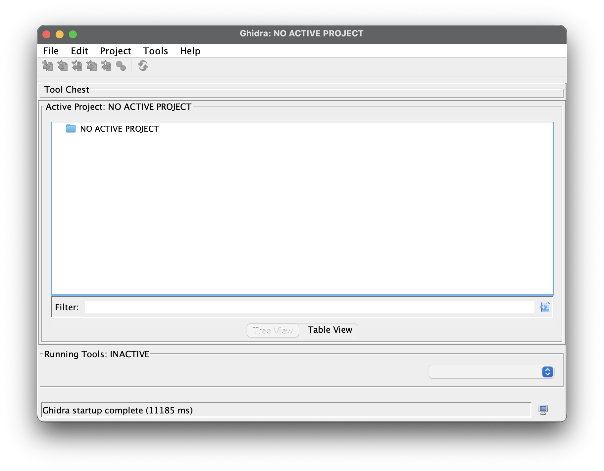

---

# Étape 2 — Ouverture de l’APK avec JADX

L’APK est chargé dans JADX GUI afin d’explorer le code Java décompilé.

## Objectif

Identifier :

* les activités principales ;
* les méthodes de vérification ;
* les appels aux bibliothèques natives.

## Capture

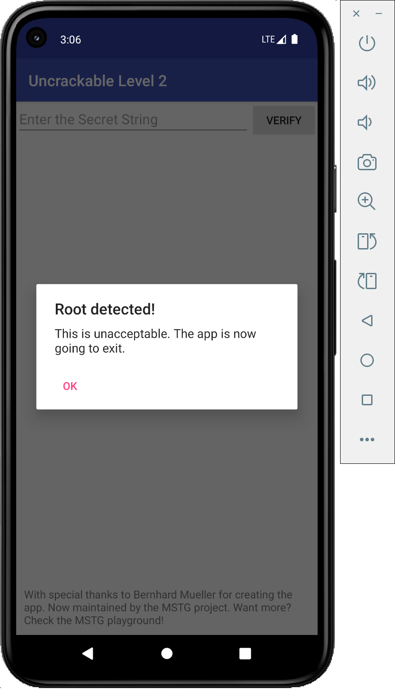

---

# Étape 3 — Analyse de la méthode verify()

La méthode `verify()` est localisée dans `MainActivity`.

Cette méthode récupère le texte saisi par l’utilisateur puis appelle une méthode de validation.

## Observations

* un message de succès apparaît si le secret est correct ;
* un message d’erreur apparaît sinon ;
* la validation réelle est effectuée ailleurs.

## Capture

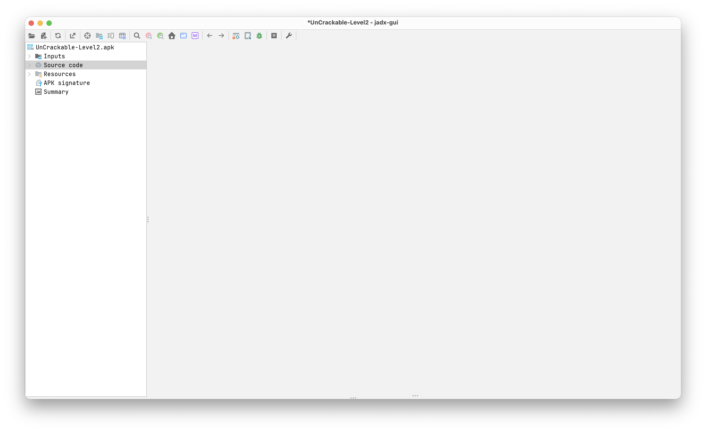

---

# Étape 4 — Analyse de la classe CodeCheck

La classe `CodeCheck` contient une méthode native appelée `bar()`.

## Analyse

```java
private native boolean bar(byte[] bArr);
```

Cela indique que la vérification du secret est réalisée dans une bibliothèque native `.so`.

## Capture

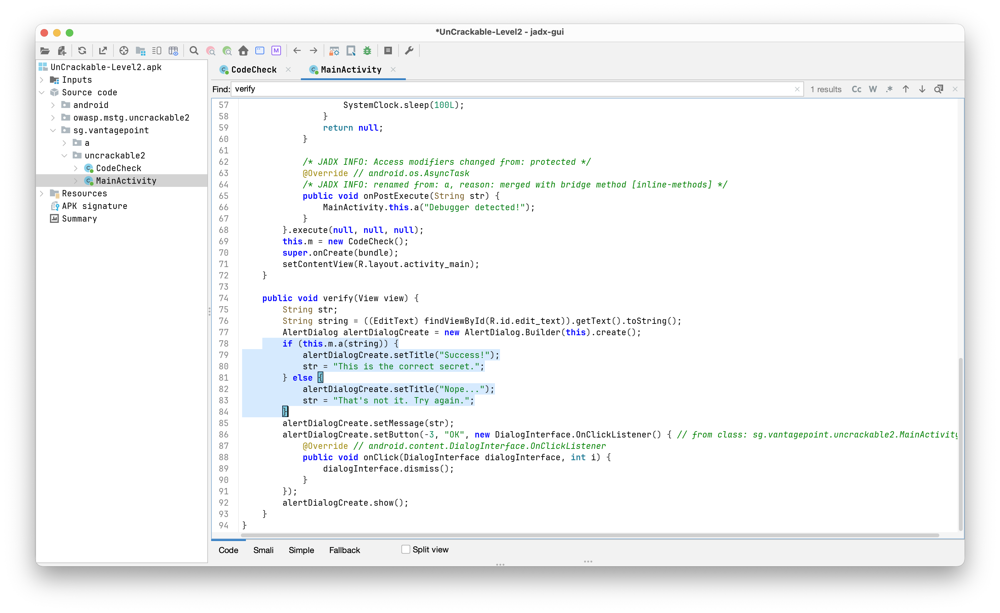

---

# Étape 5 — Identification de la bibliothèque native

Dans `MainActivity`, l’appel suivant est identifié :

```java
System.loadLibrary("foo");
```

## Explication

Android charge dynamiquement la bibliothèque native `libfoo.so`.

Cette bibliothèque contient la logique de validation du secret.

## Capture

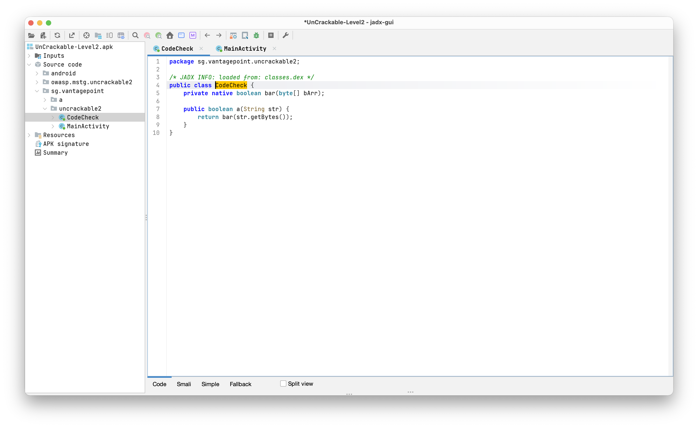

---

# Étape 6 — Extraction du contenu de l’APK

L’APK est extrait avec la commande suivante :

```bash
unzip UnCrackable-Level2.apk -d uncrackable_l2
```

## Objectif

Accéder aux bibliothèques natives présentes dans l’application.

## Capture

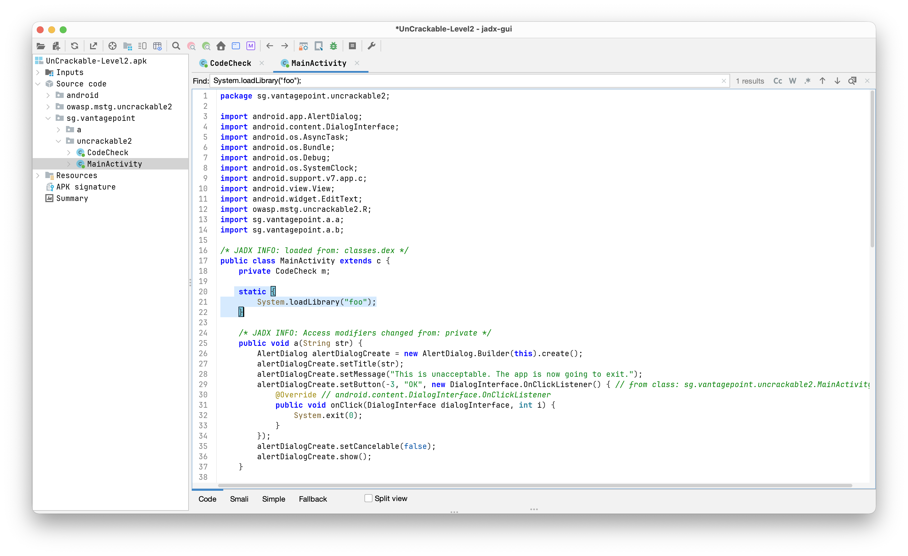

---

# Étape 7 — Localisation des bibliothèques natives

Les dossiers `lib/` sont explorés afin d’identifier les architectures supportées.

## Résultat

La bibliothèque `libfoo.so` est trouvée dans plusieurs architectures :

* arm64-v8a
* armeabi-v7a
* x86
* x86_64

## Capture

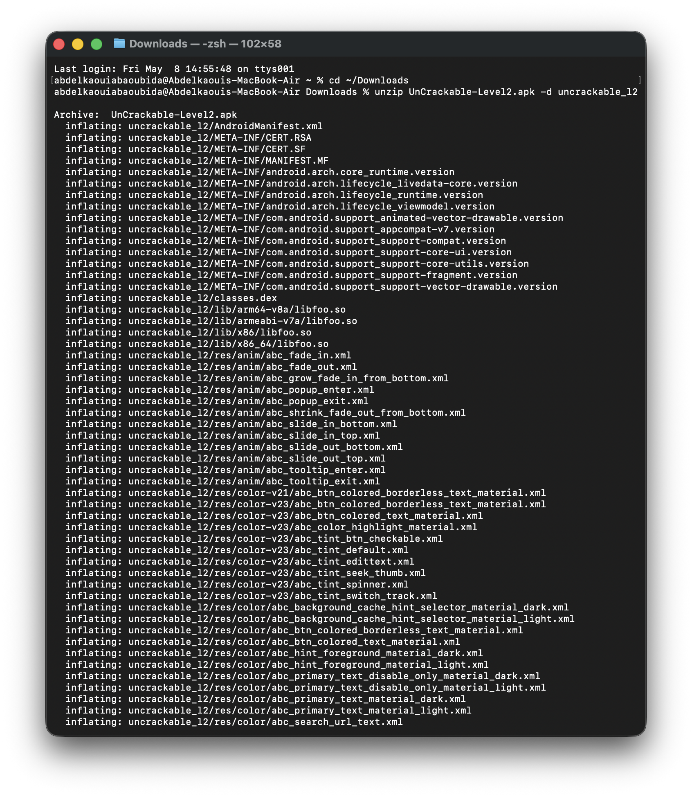

---

# Étape 8 — Importation de libfoo.so dans Ghidra

La bibliothèque native `libfoo.so` est importée dans Ghidra afin d’effectuer une analyse reverse engineering.

## Objectif

Analyser les fonctions natives responsables de la validation du secret.

## Capture

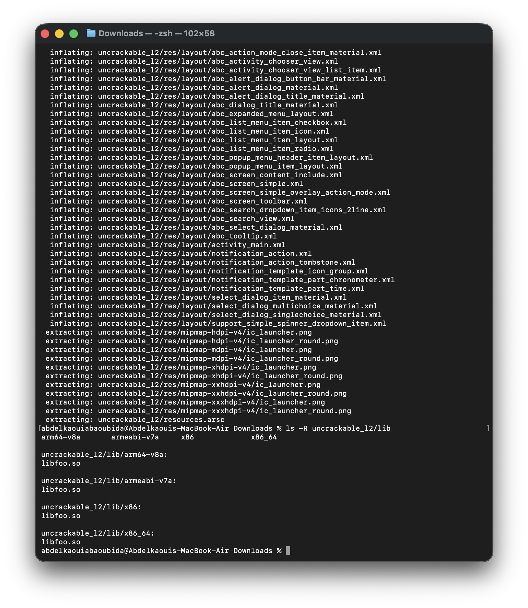

---

# Étape 9 — Analyse de la fonction JNI native

La fonction JNI suivante est identifiée dans Ghidra :

```c
Java_sg_vantagepoint_uncrackable2_CodeCheck_bar
```

## Analyse

Cette fonction compare la chaîne entrée par l’utilisateur avec une valeur cachée.

La chaîne suivante est découverte dans le code :

```text
Thanks for all the fish
```

mais sous une forme inversée et encodée.

## Capture

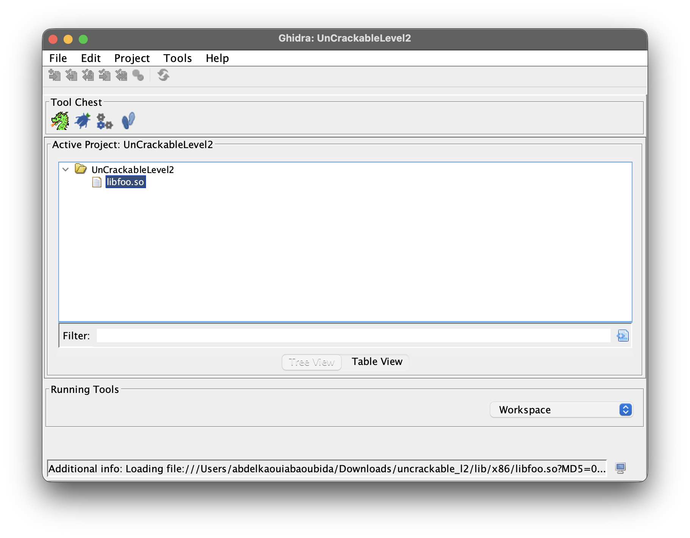

---

# Étape 10 — Décodage du secret avec Python

Une chaîne hexadécimale est décodée avec Python.

## Code utilisé

```python
hex_data = "6873696620656874206c6c6120726f6620736b6e616854"
print(bytes.fromhex(hex_data).decode("ascii"))
```

## Résultat obtenu

```text
hsif eht lla rof sknahT
```

La chaîne est lisible mais inversée.

## Capture

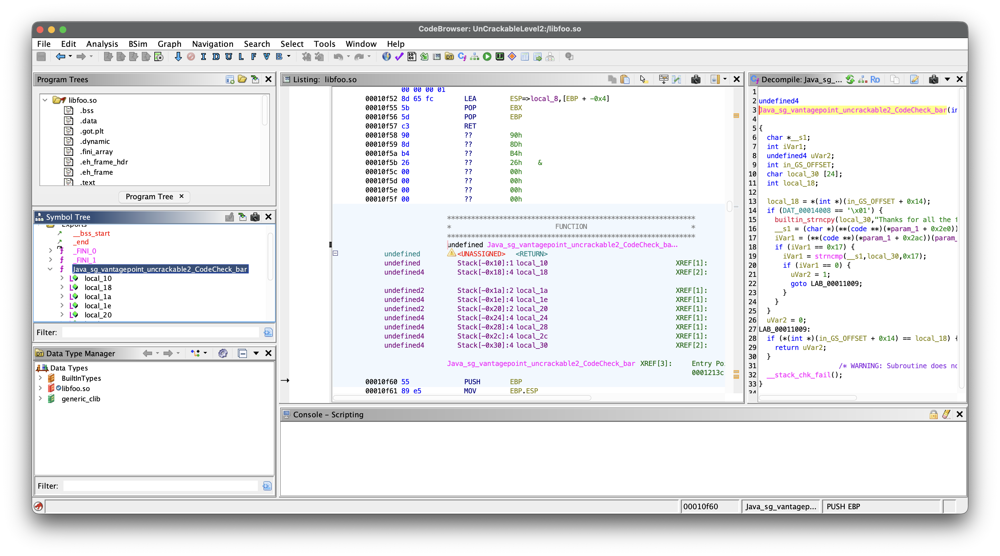

---

# Étape 11 — Inversion de la chaîne

La chaîne ASCII obtenue est inversée afin de révéler le secret final.

## Code utilisé

```python
s = "hsif eht lla rof sknahT"
print(s[::-1])
```

## Résultat final

```text
Thanks for all the fish
```

## Capture

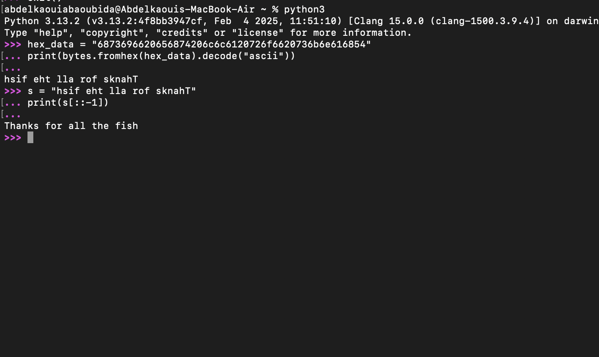

---

# Conclusion

Cette analyse statique a permis de :

* comprendre le fonctionnement de protections Android ;
* identifier une vérification réalisée en code natif ;
* analyser une bibliothèque `.so` avec Ghidra ;
* comprendre le rôle du JNI ;
* décoder un secret caché dans l’application.

---

# Outils utilisés

* Android Emulator
* JADX GUI
* Ghidra
* Python 3
* unzip
* macOS Terminal

---

# Secret Final

```text
Thanks for all the fish
```
